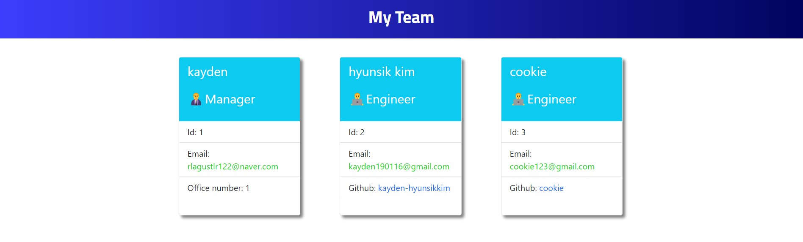

# OOP-Team-Profile-Generator

## Description

This project was created to create an application for Team member generator. It contains notes on HTML, CSS and Nodejs.

I create a Team member generator application with using the Inquirer package that meets certain criteria.

This app runs in the terminal and features dynamically updated HTML and CSS powered by node.js code.

I learned how to export and import module, write a new file with fs module and make a class to extend to others.

Also I learned write test.js to test the classes before coding so that I can write code easier
 

## Installation

N/A  

## Usage

To understand the code that I code, please read the comments in js files.

When User starts the application, the user will be prompted to enter the team manager’s name, employee ID, email address, and office number.

When User enters the team manager’s name, employee ID, email address, and office number, the user will be presented with a menu with the option to add an engineer or an intern or to finish building my team.

When User selects the engineer option, the user will be prompted to enter the engineer’s name, ID, email, and GitHub username, and I am taken back to the menu.

When User selects the intern option, the user will be prompted to enter the intern’s name, ID, email, and school, and I am taken back to the menu.
 

How to operate : Please type "node index.js" in teminal  
A walkthrough video demonstrating the functionality of the application and passing tests :
https://drive.google.com/file/d/1ppN4L37ciBebAdL8FSKjedpHJXGTfcf7/view 

 
 

(screenshot image could be slitely different with the web application)

## Credits

N/A

## License

N/A
